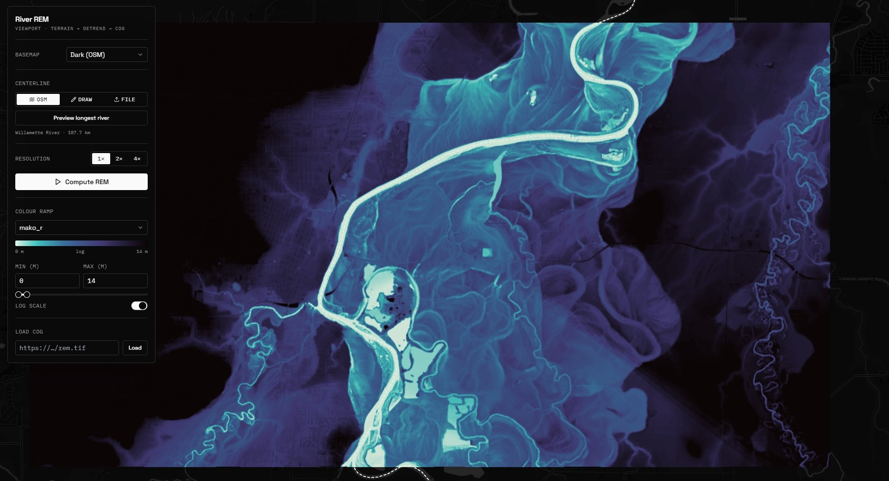

# River REM

Generate a **River Relative Elevation Model** over the current map viewport and
style it live in the browser — terrain tiles in, detrended-elevation COG out.



---

## What a River REM is (RiverREM, by OpenTopography)

This app is a web front-end around **RiverREM**, the open-source REM generator from
**OpenTopography** (Klar & Coe et al.): <https://github.com/OpenTopography/RiverREM>.
A REM re-references terrain elevation to the local **river water surface**, so the
floodplain "flattens" and paleochannels, terraces, bars and meander scrolls pop out.

The method originates with **Daniel Coe**, whose IDW technique and the visualizations
that popularized REMs are documented here —
**<https://dancoecarto.com/creating-rems-in-qgis-the-idw-method>**. The core idea:
sample the river's water-surface elevation along its centerline, **interpolate it
across the whole DEM with inverse-distance weighting (IDW)**, then subtract that
trend surface from the DEM. What's left is height-above-river, where a log-scaled or
tight colour ramp turns centimetre-scale floodplain relief into vivid channel maps.
RiverREM automates Dan Coe's QGIS workflow (centerline from OSM, IDW via KD-tree).

RiverREM's algorithm, in a few bullets (this is what runs on the backend):

- **Find the centerline.** Query OpenStreetMap for `waterway` ways in the DEM bbox,
  keep the *named* ones, group by name, and take the **longest** river by summed length.
- **Sample the water surface.** Rasterize the centerline onto the DEM grid and read
  DEM elevation at those pixels — that's the river's water-surface elevation (WSE).
- **Interpolate WSE across the DEM.** KNN **inverse-distance weighting** (power 1) via
  a KD-tree; `k` is auto-estimated from river **sinuosity** (more sinuous → larger `k`).
- **Detrend.** `REM = DEM − interpolated_WSE`. The result is metres above the river.
- (RiverREM can also bake a colour-relief × hillshade image; we deliberately **don't** —
  see "design choices".)

---

## Architecture

```
┌─────────────────────────── BROWSER (Vite + React + MapLibre) ───────────────────────────┐
│  • viewport, basemaps, draw, file import                                                 │
│  • OSM centerline via Overpass (client-side, mirror-selectable)                          │
│  • COG decode + colouring: geotiff.js + cpt2js ramps, independent min/max, log slider    │
│  • nuqs: ALL state (view + every control) lives in the URL                               │
└───────────────┬──────────────────────────────────────────────────────┬─────────────────┘
                │ POST /compute   (bbox, zoom, centerline geojson)       │ GET cog tiles
                ▼                                                        ▲ (HTTP range)
┌─────────────────────────── BACKEND (FastAPI + GDAL + RiverREM) ─────────┴────────────────┐
│  terrain.py    Mapterhorn XYZ tiles → decode RGB → mosaic (3857) → reproject UTM (metres) │
│  centerline.py OSM longest-river replica · geojson/shapefile → merged centerline shp      │
│  rem.py        REMMaker.make_rem() → warp EPSG:3857 → single-band float32 COG             │
│  main.py       /compute · /cog/ingest · /centerline/osm · /upload · static COG serving    │
└──────────────────────────────────────────────────────────────────────────────────────────┘
```

### Why this split

- **RiverREM can't run in the browser** — it needs GDAL, scipy and OSM tooling. The DEM,
  the centerline sampling and the detrend all happen **on the backend**.
- The **terrain DTM is fetched and decoded on the backend** (not the client). The only
  client-side use of Mapterhorn is the cosmetic *hillshade basemap* (`raster-dem` layer).
- The REM is served as a **single float band** COG, so **all** colour logic (ramp, min/max,
  log) stays client-side and recolours instantly — no recompute, no server round-trip.

---

## Processing flow (per Compute)

1. Browser sends the viewport `bbox`, `zoom`, resolution multiplier and a centerline.
2. `terrain.py` fetches Mapterhorn tiles at `zoom + log2(multiplier)`, decodes terrarium
   RGB → metres, mosaics in EPSG:3857, fills small gaps, reprojects to local **UTM**.
3. The centerline (OSM / drawn / imported) is written to a shapefile; connected segments
   are stitched with `linemerge` to avoid IDW seams at OSM way joins.
4. `rem.py` runs `REMMaker.make_rem()` → raw REM (UTM, float32) → warp to EPSG:3857 →
   GDAL **COG** (`-of COG`, internal overviews).
5. Browser loads the COG via `@geomatico/maplibre-cog-protocol` as a **raster-dem**
   source (`cog://…#dem`, terrarium-encoded) and tints it with a native MapLibre
   **`color-relief`** layer. Ramp/min/max/reverse changes just update the paint
   expression — instant GPU recolour, no recompute.

### Payloads

`POST /compute`
```json
{
  "bbox": { "west": -123.33, "south": 44.54, "east": -123.17, "north": 44.60 },
  "zoom": 13,
  "resolution_multiplier": 1,
  "centerline_mode": "geojson",
  "centerline_geojson": { "type": "FeatureCollection", "features": [ /* LineStrings */ ] },
  "upload_id": null
}
```
→ `{ job_id, cog_url, bounds:[w,s,e,n], rem_min, rem_max, river_name, river_length_m }`

`POST /cog/ingest` → `{ "url": "https://…/dem.tif" }`
→ `{ cog_url, bounds, rem_min, rem_max }` (reprojects any-CRS COG to a 3857 COG)

`POST /centerline/osm` (legacy/fallback; the client now uses Overpass directly).
`POST /upload` (zipped shapefile) → `{ upload_id }`.

### Centerline modes

- **OSM** — Overpass query in the browser (mirror selectable: overpass.de, kumi.systems,
  private.coffee, osm.ch, qlever*). Replicates RiverREM's longest-named-river pick. The
  resulting GeoJSON is previewed *and* sent, so the backend skips its own slow osmnx call.
- **Draw** — hand-draw a LineString (terra-draw).
- **File** — import `.geojson`/`.json` (parsed client-side) or a zipped `.shp` (backend).

\* qlever speaks SPARQL, not Overpass QL — it's experimental and falls back if it fails.

---

## Deploy (Docker Compose → Portainer + Traefik)

Two services — **standard for a Python API + JS front-end**: `api` (FastAPI + GDAL +
RiverREM) and `web` (the Vite build served by a tiny **nginx** that also same-origin
proxies the API/COGs to `api`, like your kepler stack). **TLS is terminated by your
existing Traefik** via the external `traefik_proxy` network + `leresolver` — the
container does no TLS itself.

```
              Traefik (websecure, leresolver)
                        |  Host(rem.prod.heritagewatch.ai)
                  [ web ] nginx ── /  ───────────────► SPA (static)
                        |         ── /cogs/* /compute* … ─► [ api ] FastAPI ─► volume: cogs
                     (internal network)
```

Set DNS for the domain at the Traefik host and ensure the external `traefik_proxy`
network exists. Stack env (Portainer → Environment variables, or `.env` — see
`.env.example`):

```
DOMAIN=rem.prod.heritagewatch.ai
PUBLIC_BASE=https://rem.prod.heritagewatch.ai
VITE_API_BASE=
```

**Persistence:** COGs are written under `DATA_DIR=/data` into the named volume `cogs`,
so they survive redeploys; a share link `…/?cog=https://rem.prod.heritagewatch.ai/cogs/<id>/rem_REM.tif&…`
keeps working (permanent + same-origin). The `api` stays on an internal network
(reachable only through nginx); only `web` carries Traefik labels.

### Option A — build on the host (Git stack)

Portainer → Stacks → *Add stack* → **Repository**, compose path `docker-compose.yml`.
Portainer builds both images on the host, so **CE needs no registry pull of your app
images** (only public base images: gdal, node, nginx).

### Option B — pull prebuilt images from GHCR (image in the registry, not the repo)

The cleaner "container out of the repo, only in Portainer" path:

1. CI builds + pushes on every push to `main` — `.github/workflows/build-and-push.yml`
   → `ghcr.io/<owner>/riverrem-api` and `…/riverrem-web`. Uses the built-in
   `GITHUB_TOKEN`; no secrets to add. Make the GHCR packages private if you like.
2. **Portainer → Registries → Add registry → Custom**: URL `ghcr.io`, username = your
   GitHub user, password = a **PAT with `read:packages`** (only needed if private).
3. Deploy `docker-compose.ghcr.yml` — as a Git stack, or just **paste it into
   Portainer's web editor** (source no longer needs to be on the host). Set `OWNER`
   (lowercase, e.g. `iconem`) and optionally `TAG`.

**Image weight:** `web` is `nginx:1.29-alpine` (~50 MB) over the static build. `api`
uses `ghcr.io/osgeo/gdal:ubuntu-small-3.8.4` — GDAL + the RiverREM stack
(numpy/scipy/rasterio/shapely/osmnx) is inherently chunky; ubuntu-small with
`--no-install-recommends`, `--no-cache-dir`, and a post-install `git` purge is the
pragmatic lightest. (Alpine/musl GDAL is smaller but fights prebuilt wheels.)

---

## Run it / develop

**Fast hot-reload dev** (recommended while coding) — backend in Docker, Vite HMR for
the front-end:

Backend:
```
cd backend
docker build -t riverrem-api .
docker run -p 8000:8000 -e PUBLIC_BASE=http://localhost:8000 -v %cd%/data:/data riverrem-api
```
Frontend (separate terminal):
```
cd frontend
pnpm install
echo VITE_API_BASE=http://localhost:8000> .env.local
pnpm dev
```
Open http://localhost:5173 (HMR; API on :8000). Backend env overrides:
`TERRAIN_TILE_URL`, `TERRAIN_ENCODING` (`terrarium`|`mapbox`), `TERRAIN_MAX_ZOOM`,
`PUBLIC_BASE`, `DATA_DIR`.

**Full-stack smoke test** (one command — exact prod build + the nginx same-origin
proxy, no Traefik):
```
docker compose -f docker-compose.local.yml up --build
```
Open http://localhost:8080.

---

## Styling controls

- **Colour ramp** — cpt-style ramps with live gradient previews (mako_r, blues_r, a
  black-and-white **gray** ramp first; plus viridis, spectral, topo, inferno, magma,
  plasma, cividis, turbo, terrain, rdbu_r), and a **Reverse** toggle that flips any ramp.
  `cptToStops()` imports arbitrary GMT `.cpt` palettes via cpt2js.
- **Min / Max (m)** — independent. The **max slider** is logarithmic when "Log max slider"
  is on: the slider position is an exponent and `max = 10^pos`, so you keep fine control at
  a 1 m ceiling *and* a 100 m ceiling. Slider bounds auto-scale to ~2× the computed range.
- **Basemaps** — Dark (CARTO/OSM), Satellite (Esri), or live **Hillshade** from Mapterhorn.
- **Load COG** — any single-band float COG, any CRS: the backend opens it via `/vsicurl`,
  reprojects to a 3857 overview COG, and the map fits to its true extent.

## Exports, runs & sharing

- **Export** (after a compute): a **composite PNG** (the REM rendered through the current
  ramp/min/max/reverse), the **raw REM COG** (float, georeferenced — the real deliverable),
  the **source DEM COG**, and the **centerline GeoJSON**.
- **Runs** — every compute/loaded COG is saved to browser `localStorage` (no auth). The Runs
  list reloads any past REM as the active layer with its styling. Delete with the trash icon.
- **Share link** — copies the current URL. nuqs keeps *everything* in the URL (view, all
  controls, **and** the active COG reference + bounds), so a link reproduces the exact styled
  REM on any machine — the COGs are public. (For real sharing, run the backend on a public
  `PUBLIC_BASE`, not localhost.)
- **Progress** — compute shows staged hints (terrain → centerline → detrend → COG → tiles)
  with elapsed time. It's an indeterminate hint, not a true percentage (synchronous backend).

---

## Design choices / things to verify

- **Terrain source** defaults to Mapterhorn `https://tiles.mapterhorn.com/{z}/{x}/{y}.webp`,
  512 px tiles, *terrarium* encoding (~4 mm vertical quantization — fine; the real limit is
  source DEM horizontal resolution). The usable zoom is **probed per viewport** (deepest
  existing centre tile, up to z20), so 2×/4× fetch genuinely higher-res tiles where they
  exist; failed tiles are retried, and remaining gaps are filled. For a lidar-grade REM,
  point `terrain.py` at a real DEM (**OpenTopography** / USGS 3DEP).
- **REM colouring is GPU-native:** the geomatico COG protocol decodes the float COG
  into a terrarium-encoded `raster-dem`, and a MapLibre **`color-relief`** layer applies
  the ramp (built from the selected stops, remapped to the min/max). Recolour is a paint
  update — instant, no re-fetch. NoData is encoded to a low sentinel and rendered
  transparent via a floor stop. (Needs maplibre-gl ≥ 5.6; bumped from 4.7.)
- **Sharpness / blockiness:** `color-relief` has **no** `raster-resampling` knob
  (that's `raster`-layer only; linear resampling for color-relief/hillshade is the
  open request maplibre-gl-js#7154). The REM source uses **512px tiles**, and an
  **Oversample** control (1×/2×/4×) calls `map.setPixelRatio(factor × devicePixelRatio)`
  (capped at 4) to supersample the GL canvas — the practical fix for blocky imported
  COGs on 4K displays. The hard limit remains the source DEM's horizontal resolution.
- **Progress** is real: `/compute` runs as a background job; a logging handler parses
  RiverREM's interpolation `%` and phase lines, surfaced via `GET /compute/{job_id}`
  polling. The UI advances ~20%/step and shows the true % during the slow KD-tree step.
- Higher resolution multipliers need higher-zoom tiles; where the source has none, coverage
  is checked and gaps are filled, else compute returns a clear message.
- Not exhaustively run end-to-end across every CRS/area — treat as a working scaffold.

## Scaling alternatives

`/compute` is synchronous; swap it for an enqueue + poll on **trigger.dev** (self-hosted)
without touching the pipeline functions. For server-side OGC styling, front the COGs with
**TiTiler** (XYZ/WMTS with on-the-fly `rescale` + `colormap`).
