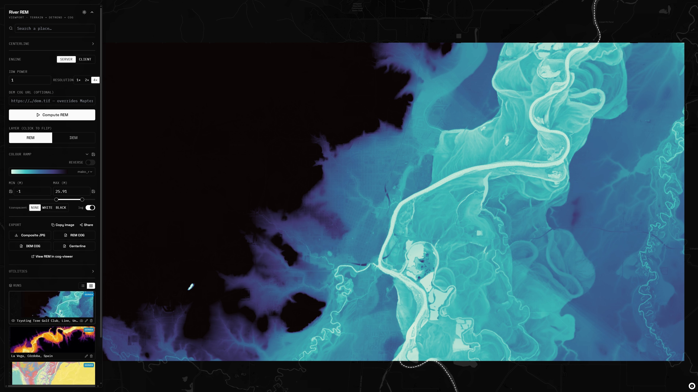

# River REM

Generate a **River Relative Elevation Model (REM)** over the current map viewport and
style it live in the browser — terrain tiles in, detrended-elevation map out.

- **Server engine** — Python [OpenTopography/RiverREM](https://github.com/OpenTopography/RiverREM) on a FastAPI/GDAL backend.
- **Client engine (beta)** — a pure-frontend JS/WebGL path that interpolates the water surface in the browser, no backend.



---

## What a REM is

A REM re-references terrain to the local **river water surface**, so the floodplain
"flattens" and paleochannels, terraces, bars and meander scrolls pop out. The method is
**Daniel Coe's** [IDW technique](https://dancoecarto.com/creating-rems-in-qgis-the-idw-method),
automated by **RiverREM** (Klar & Coe et al., OpenTopography —
[announcement](https://opentopography.org/blog/new-package-automates-river-relative-elevation-model-rem-generation)):

1. **Centerline** — query OSM for named `waterway` ways in the view, keep the **longest** (or draw / import one).
2. **Sample WSE** — read DEM elevation along the centerline (the river's water-surface elevation).
3. **Interpolate** — spread WSE across the DEM with **inverse-distance weighting** (in EPSG:3857).
4. **Detrend** — `REM = DEM - WSE`, i.e. metres above the river; colour it with a log-scaled / tight ramp.

The REM is served as a single float band, so **all** colour logic (ramp, min/max, log,
transparency) stays client-side and recolours instantly with no recompute.

---

## Two engines

| | **Server** (default) | **Client** (beta) |
|---|---|---|
| Where | FastAPI + GDAL + RiverREM | entirely in the browser |
| DEM | Mapterhorn tiles -> UTM mosaic | Mapterhorn tiles, read per-tile |
| IDW | RiverREM: **k-NN, power 1**, KD-tree, `k` from sinuosity (faithful) | **all sampled points**, power configurable (QGIS-style) |
| Output | single-band float32 COG (EPSG:3857) | `rem://` terrarium tiles built live, per tile |
| Strength | fidelity, full-res, exports | no backend, live recompute, fast |

Both feed the **same** MapLibre `color-relief` layer, so every styling control works identically.

### Client engine — how it works

The tiled terrain source makes a backend optional. Once the river is queried and its WSE
sampled, a custom MapLibre protocol `rem://{z}/{x}/{y}` fetches each Terrarium terrain tile
on demand, runs IDW over the sampled points to get WSE, and emits the detrended
`REM = DEM - WSE` **re-encoded as Terrarium** — so a standard `color-relief` layer can tint
it. IDW runs on the CPU (or GPU, where it's a global all-points interpolation rather than
k-nearest). The deepest available Mapterhorn zoom is probed per viewport and used as the
source `maxzoom` so tiles past the source resolution aren't requested.

A standalone single-file version lives at **`/rem-pure-frontend.html`** (no build step).

> Note on fidelity: the server engine reproduces the **RiverREM package** (k-NN, power 1);
> the client engine reproduces the **QGIS / Dan Coe** flavour (all-points, power ~2). Both
> are valid — pick the engine for the contract you want.

---

## Architecture

```
+---------------- BROWSER (Vite + React + MapLibre) ----------------+
| viewport - basemaps - draw/import - OSM centerline (Overpass/QLever)|
| colour: color-relief + cpt ramps, independent min/max, log slider  |
| client engine: rem:// terrarium tiles (per-tile IDW)               |
| nuqs: all state (view + every control + active COG) lives in the URL|
+---------+-----------------------------------------+----------------+
          | POST /compute (bbox, zoom, centerline)   | GET cog tiles (HTTP range)
          v                                          ^
+---------------- BACKEND (FastAPI + GDAL + RiverREM) +--------------+
| terrain.py   Mapterhorn tiles -> decode -> mosaic (3857) -> UTM    |
| centerline.py  OSM longest-river - geojson/shapefile -> centerline |
| rem.py   REMMaker.make_rem() -> warp 3857 -> single-band float COG |
| main.py  /compute - /cog/ingest - /thumb - /upload - static COGs   |
+--------------------------------------------------------------------+
```

Why the split: RiverREM needs GDAL/scipy/OSM tooling, so the server engine fetches the DEM,
samples the centerline and detrends on the backend, then serves a float COG the client
recolours instantly. The client engine skips all of that and runs in the browser.

### `POST /compute`
```json
{
  "bbox": { "west": -123.33, "south": 44.54, "east": -123.17, "north": 44.60 },
  "zoom": 13, "resolution_multiplier": 1, "idw_power": 2,
  "centerline_mode": "geojson",
  "centerline_geojson": { "type": "FeatureCollection", "features": [] },
  "source_cog_url": null
}
```
-> `{ job_id, cog_url, dem_url, bounds:[w,s,e,n], rem_min, rem_max, width, height, river_name, river_length_m }`

Other endpoints: `POST /cog/ingest` (reproject any-CRS COG to 3857), `POST /upload`
(zipped shapefile -> `upload_id`), `POST /thumb` (store a run thumbnail), `POST /runs/prune`.
`source_cog_url` lets RiverREM use your own elevation COG (read via GDAL `/vsicurl/`)
instead of Mapterhorn.

---

## Run it

**Local / dev** (hot reload, API on :8000, Vite on :5173):
```
cd backend
docker build -t riverrem-api .
docker run --rm -p 8000:8000 -e PUBLIC_BASE=http://localhost:8000 -v %cd%\data:/data riverrem-api
```
```
cd frontend
pnpm install
echo VITE_API_BASE=http://localhost:8000> .env.local
pnpm dev
```

**Full-stack smoke test** (prod build + nginx same-origin proxy, no Traefik):
```
docker compose -f docker-compose.local.yml up --build
```
Open http://localhost:8088 (override with `WEB_PORT=NNNN`).

Backend env: `TERRAIN_TILE_URL`, `TERRAIN_ENCODING` (`terrarium`|`mapbox`),
`TERRAIN_MAX_ZOOM`, `PUBLIC_BASE`, `DATA_DIR`, `MAX_COGS`.

---

## Deploy (Docker Compose -> Portainer + Traefik)

Two services: `api` (FastAPI + GDAL + RiverREM, internal network) and `web` (the Vite build
on a tiny **nginx** that same-origin-proxies the API/COGs to `api`). **TLS is terminated by
your existing Traefik** via the external `traefik_proxy` network — the container does no TLS.

```
              Traefik (websecure, cert resolver)
                        |  Host(${DOMAIN})
                  [ web ] nginx -- /  ------------> SPA (static)
                        |         -- /cogs/* /compute ... -> [ api ] FastAPI -> volume: cogs
                     (internal network)
```

Deploy `docker-compose.yml` as a Portainer Git stack (builds both images on the host — CE
needs no registry for your app images). Set stack env (or `.env`, see `.env.example`):

```
DOMAIN=rem.example.com
PUBLIC_BASE=https://rem.example.com
VITE_API_BASE=
```

Persistence: COGs live in the `cogs` volume (capped by `MAX_COGS`, oldest evicted), so
redeploys and share links keep working. The build commit hash can be shown in the footer by
passing `--build-arg VITE_GIT_SHA=$(git rev-parse --short HEAD)` (CI passes it automatically;
see `.github/workflows/build-and-push.yml`, which also publishes images to GHCR if you'd
rather pull prebuilt — point the compose `image:` at your registry and drop the `build:` blocks).

`api` uses `ghcr.io/osgeo/gdal:ubuntu-small-3.8.4`; `web` is `nginx:1.29-alpine` over the static build.

---

## Controls

- **Engine** — Server (RiverREM COG) or Client (live in-browser tiles); **IDW power** applies to both.
- **Colour ramp** — cpt-style ramps with live previews (mako_r, blues_r, gray, viridis,
  spectral, topo, inferno, magma, plasma, cividis, turbo, terrain, rdbu_r, set3), **Reverse**,
  and `.cpt` import via cpt2js.
- **Min / Max (m)** — independent, with a **log** slider and customisable slider bounds.
- **Transparent** — fade the white or black end so a basemap shows through.
- **Layer** — flip between REM and DEM (independent bounds each).
- **Basemaps** — Dark / Light (CARTO), Satellite (Esri), opaque Hillshade (Mapterhorn), None.
- **Resolution** (server) — 1x/2x/4x, probed against the deepest zoom Mapterhorn serves here.
- **Runs** — every compute/loaded COG is saved to `localStorage` (server/client chip), reloadable
  with its full styling; list or gallery view, rename/delete/duplicate, thumbnails.
- **Export** — composite JPG, raw REM COG (the deliverable), source DEM COG, centerline GeoJSON.
- **Share** — nuqs keeps everything in the URL (view + controls + active COG), so a link
  reproduces the exact styled REM (COGs are public).

---

## Future work

`/compute` is synchronous; an enqueue + poll (e.g. self-hosted trigger.dev) would scale it
without touching the pipeline. For server-side OGC styling, front the COGs with **TiTiler**.
For the client engine, a WebGPU compute path (with a spatial grid for true k-NN) would bring
GPU IDW to full fidelity.

## Credits

REM method: [Dan Coe - IDW](https://dancoecarto.com/creating-rems-in-qgis-the-idw-method),
automated by [OpenTopography RiverREM](https://github.com/OpenTopography/RiverREM).
Terrain (c) [Mapterhorn](https://mapterhorn.com). Made by [jo-chemla](https://x.com/jo_chemla) -
[Iconem](https://iconem.com).
